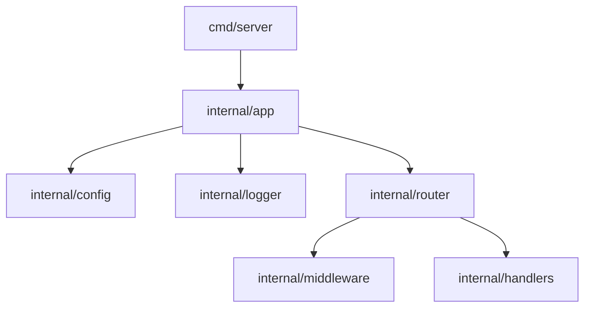

# Gin API Template 🚀

[](https://golang.org)
[](https://opensource.org/licenses/MIT)
[](https://github.com/bereket-7)

An production-ready starter template for building high-performance RESTful APIs with **Go** and the **Gin** framework. This template implements best practices for clean architecture, structured logging, and configuration management.

---

## 🏗️ Project Architecture

This project follows a **Clean Architecture** pattern, ensuring separation of concerns and making the codebase highly testable and maintainable.



### Key Components

- **`cmd/`**: Entry point for the application.
- **`internal/app`**: Bootstraps the server, initializes components (config, logger, router).
- **`internal/config`**: Environment-based configuration using `godotenv`.
- **`internal/logger`**: Structured, high-performance logging powered by `uber-go/zap`.
- **`internal/router`**: Centralized route definitions and middleware orchestration.
- **`pkg/`**: Public libraries meant to be shared across multiple applications.

---

## ✨ Features

- **⚡ Blazing Fast**: Built on top of the Gin framework for minimal overhead.
- **📝 Structured Logging**: Production-ready logging with `zap` supporting JSON output and rotation.
- **🛡️ Resilience**: Integrated recovery middleware to handle panics gracefully.
- **⚙️ Environment Management**: Seamless configuration across Dev, Staging, and Production.
- **🏗️ Organized Structure**: Modular design for easy scaling.
- **🛠️ Developer-First**: Includes a `Makefile` for streamlined development tasks.

---

## 🚀 Getting Started

### Prerequisites

- Go `1.25+` (Recommended)
- Make (Optional, for using Makefile)

### Installation

1. **Clone the repository:**
   ```bash
   git clone https://github.com/bereket-7/gin-template.git
   cd gin-template
   ```

2. **Setup configuration:**
   ```bash
   cp .env.example .env
   ```

3. **Install dependencies:**
   ```bash
   go mod download
   ```

### Running the Application

#### Local Development
Using **Make**:
```bash
make run
```

Or using **Go CLI**:
```bash
go run cmd/server/main.go
```

#### Docker (Recommended)
You can run the entire stack (API + Redis) using Docker Compose:

```bash
# Start the services
docker-compose up --build

# Run in background
docker-compose up -d
```

The server will start at `http://localhost:8080` (as configured in `docker-compose.yml`).

---

## 🐋 Docker Usage

### Build Image
```bash
docker build -t gin-api .
```

### Run with Docker Compose
```bash
docker-compose up --build
```

---

## ⚙️ Configuration

The application uses environment variables for configuration. See `.env.example` for details:

| Variable | Description | Default |
|----------|-------------|---------|
| `APP_ENV` | Application environment (development/production) | `development` |
| `APP_PORT` | Port the server listens on | `8500` |
| `ALLOWED_ORIGINS` | CORS allowed origins | `*` |

---

## 🛠️ Development Tools

Utilize the provided `Makefile` for common tasks:

- `make run`: Starts the development server.
- `make build`: Compiles the binary into the `bin/` directory.
- `make test`: Runs the test suite for all packages.

---

## 👤 Author

**Bereket**
- GitHub: [@bereket-7](https://github.com/bereket-7)
- Projects: [github.com/bereket-7/gin-template](https://github.com/bereket-7/gin-template)

---

## 📄 License

This project is licensed under the MIT License - see the [LICENSE](LICENSE) file for details.
